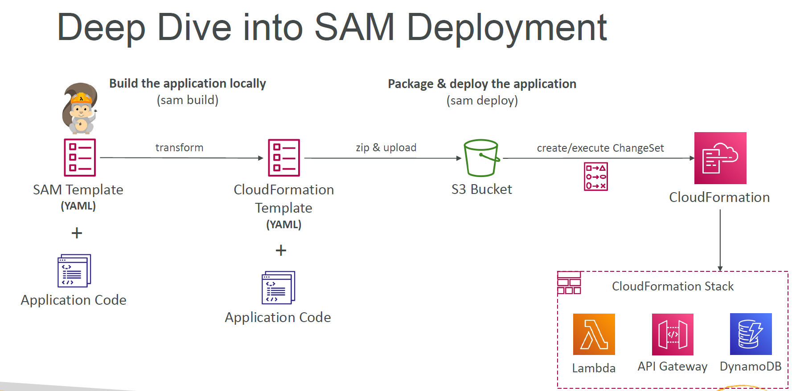

# SAMDeploymentUsngAWS
Project to work towards Getting AWS component using AWS SAM module

## Deep Dive Into SAM Deployment
- Create app.py
- Create SAM Template(Yaml file)
- create a Cloud Formation template
- Run and test all the steps using clud formation in AWS

